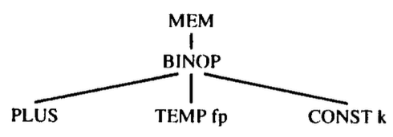

# tiger compiler
## 1. 项目概览
### 1.1 项目目标
用lex写出一个tiger语言的词法分析器，用YACC的分析方法完成对某一个的语法分析，并生成语法树和中间代码  
[Tiger Language Reference Manual](https://www.lrde.epita.fr/~tiger/tiger.html#Tiger-Language-Reference-Manual)  
[虎书的官方代码](http://www.cs.princeton.edu/~appel/modern/c/project.html)  
实验结果结果用graphviz进行可视化  

### 1.2 测试和运行
#### 运行
```bash
go generate
./tiger testcases/test4.tig
```
#### lex 单元测试
```bash
cd yacc
go test -v -run='Test_Lex' -args ../testcases/test4.tig
```
#### yacc 单元测试
```bash
cd yacc
go test -v -run='Test_Yacc' -args ../testcases/test4.tig
```
未通过的测试 
6 12
### 1.3 代码完成情况
* [✔︎] absyn 抽象语法树
    * absyn
    * dec
    * exp
    * pos
    * print
    * ty
    * var
* [✔︎] env 类型符号表和变量符号表
    * entry
    * env
* [✔︎] frame 栈帧
    * access
    * frag
        * ProcFrag
        * StringFrag
    * frame 
* semant 语义分析至中间代码生成
    * semant => SEM_transProg()
    * transDec
    * transExp 
    * transVar 
    * ty 
* [✔︎] symbol 符号
    * symbol
* [✔︎] table 用来存储symbol和temp
    * table
* [✔︎] temp
    * label
    * map
    * temp
* [✔︎] translate
    * access 将frame通过level连起来
    * exp 通过方法 Ex, Cx 或 Nx 来生成具体的结点  
    * level 层
    * patch
    * translate
* [✔︎] tree ir树
    * exp
    * op 
    * print 
    * stm 
* [✔︎] types 所有的类型
    * types
* [✔︎] util
* [✔︎] yacc
    * lex.go
    * tiger.y
   
## 2. 词法分析
位于`yacc/lex.go`  
go语言没有lex工具，所以我们根据下面的lex(c语言)手写了一个lex分析器  

### 利用lex进行词法分析
```c
%{
#include <string.h>
#include "absyn.h"
#include "y.tab.h"
#include "errormsg.h"

int charPos=1;

int yywrap(void)
{
    charPos=1;
    return 1;
}

/* 用来储存程序中的字符串 */
char *str = NULL;
int strSize = 0;
int strLen = 0;

/* 初始化呢一个字符串 */
void initString(void)
{
	str = checked_malloc(64);
	strSize = 64;
	strLen = 0;
	str[0] = 0;
}

void addString(char *s)
{
    /* 当字符串空间不足时，重新申请一个两倍于原大小的字符串 */
	if (strLen + strlen(s) >= strSize) {
		strSize *= 2;
        str = realloc(str, strSize);
		if (str == NULL) {
            printf("malloc error!\n");
            exit(1);
        }
	}
	strLen += strlen(s);
	strcat(str, s);
}

/* 销毁原来的字符串 */
void destroyString(void)
{
    free(str);
    str = NULL;
}

void adjust(void)
{
    EM_tokPos=charPos;
    charPos+=yyleng;
}

%}
%x STR COMMENT
%%
/* 空格和tab不做处理 */
[ \t]		{adjust(); continue;}
(\n|\r\n)	{adjust(); EM_newline(); continue;}

/* 以下为Tiger的保留字 */
"while"		{adjust(); return WHILE;}
"for"		{adjust(); return FOR;}
"to"		{adjust(); return TO;}
"break"		{adjust(); return BREAK;}
"let"		{adjust(); return LET;}
"in"		{adjust(); return IN;}
"end"		{adjust(); return END;}
"function"	{adjust(); return FUNCTION;}
"var"		{adjust(); return VAR;}
"type"		{adjust(); return TYPE;}
"array"		{adjust(); return ARRAY;}
"if"		{adjust(); return IF;}
"then"		{adjust(); return THEN;}
"else"		{adjust(); return ELSE;}
"do"		{adjust(); return DO;}
"of"		{adjust(); return OF;}
"nil"		{adjust(); return NIL;}

/* 以下为Tiger的标点符号 */
","			{adjust(); return COMMA;}
":"			{adjust(); return COLON;}
";"			{adjust(); return SEMICOLON;}
"("			{adjust(); return LPAREN;}
")"			{adjust(); return RPAREN;}
"["			{adjust(); return LBRACK;}
"]"			{adjust(); return RBRACK;}
"{"			{adjust(); return LBRACE;}
"}"			{adjust(); return RBRACE;}
"."			{adjust(); return DOT;}
"+"			{adjust(); return PLUS;}
"-"			{adjust(); return MINUS;}
"*"			{adjust(); return TIMES;}
"/"			{adjust(); return DIVIDE;}
"="			{adjust(); return EQ;}
"<>"		{adjust(); return NEQ;}
"<"			{adjust(); return LT;}
"<="		{adjust(); return LE;}
">"			{adjust(); return GT;}
">="		{adjust(); return GE;}
"&"			{adjust(); return AND;}
"|"			{adjust(); return OR;}
":="		{adjust(); return ASSIGN;}

/* 处理数字和标识符 */
[0-9]+		{adjust(); yylval.ival=atoi(yytext); return INT;}
[a-zA-Z][a-zA-Z0-9_]*	{adjust(); yylval.sval=yytext; return ID;}

/* "表示字符串的开始，状态变为STR,初始化字符串 */
\"          {adjust(); BEGIN(STR); initString();}
/* /*表示注释的开始，状态变为COMMENT */
"/*"		{adjust(); BEGIN(COMMENT);}

<STR>{
    /* 第二个"表示字符串的结束，将字符串传递给yylval,状态变回INITAL,销毁字符串 */
	\"					{adjust(); yylval.sval=String(str); BEGIN(INITIAL); destroyString(); return STRING;}
	\\n					{adjust(); addString("\n");}
	\\t					{adjust(); addString("\t");}
	\\[0-9]{3}			{adjust(); addString(yytext);}
	\\\\				{adjust(); addString(yytext);}
	\\\"				{adjust(); addString(yytext);}
	[^\"\\\n(\r\n)]+	{adjust(); addString(yytext);}
	\\[ \n\t\r\f]+\\	{adjust();continue;}
    /* 字符串中间的异常处理 */
	\\(.|\n)			{adjust(); EM_error(EM_tokPos, "illegal token");}
	(\n|\r\n)			{adjust(); EM_error(EM_tokPos, "illegal token");}
	<<EOF>>				{adjust(); EM_error(EM_tokPos, "EOF in string"); return 0;}
}
<COMMENT>{
	[^*]*		{adjust(); continue;}
	"*"+[^*/]*	{adjust(); continue;}
    /* 遇到*/表示注释结束，状态变为INITIAL */
	"*"+"/"		{adjust(); BEGIN(INITIAL);}
}
.			{adjust(); EM_error(EM_tokPos,"illegal token");}
```

## 3. 语法分析
位于`yacc/tiger.y`  

### 利用yacc进行语法分析

[bison 帮助文档](https://www.lrde.epita.fr/~tiger/doc/bison.html)

```
%{
package yacc
import(
    "github.com/MeteorKL/tiger/absyn"
    "github.com/MeteorKL/tiger/symbol"
)
const(
    EOF = 0
    Debug = 0
    ErrorVerbose = true
)
var Absyn_root absyn.Exp;
%}

/* 重新定义YYSTYPE，即在语法分析过程中用到的 */
%union {
	ty         absyn.Ty
	namety     absyn.Namety
	sym        symbol.Symbol
	Var        absyn.Var
	exp        absyn.Exp
	expList    absyn.ExpList
	dec        absyn.Dec
	decList    absyn.DecList
	field      absyn.Field
	fieldList  absyn.FieldList
	fundec     absyn.Fundec
	fundecList absyn.FundecList
	nametyList absyn.NametyList
	efield     absyn.Efield
	efieldList absyn.EfieldList

	ival int
	sval string
}

/* 定义非终结符，<?>为非终结符的类型（这里表现为抽象语法树的节点），后面为非终结符的名称 */
%type <ty> ty
%type <namety> tydec
%type <sym> id
%type <Var> lvalue
%type <exp> root exp let cond
%type <expList> arglist arg explst
%type <dec> dec vardec tydecs fundecs
%type <decList> decs
%type <field> tyfield
%type <fieldList> tyfields ty_field
%type <fundec> fundec
%type <efieldList> recordlist record

/* 定义字符串类型的终结符 */
%token <sval> ID STRING
/* 定义整数类型的终结符 */
%token <ival> INT

/* 定义其它终结符 */
%token 
  /* 标点符号 */
  COMMA COLON SEMICOLON LPAREN RPAREN LBRACK RBRACK LBRACE RBRACE DOT PLUS MINUS TIMES DIVIDE EQ NEQ LT LE GT GE AND OR ASSIGN
  /* 保留字 */
  reserved_word_beg
  WHILE FOR TO BREAK LET IN END FUNCTION VAR TYPE ARRAY IF THEN ELSE DO OF NIL
  reserved_word_end
  ILLEGAL


/* 定义从低到高的优先级,预设一个最低优先级LOW */
%nonassoc LOW
%nonassoc THEN DO TYPE FUNCTION ID 
%nonassoc ASSIGN LBRACK ELSE OF COMMA
%left OR
%left AND
%nonassoc EQ NEQ LE LT GT GE
%left PLUS MINUS
%left TIMES DIVIDE
%left UMINUS

/* 文法起始符 */
%start program
%%
/* 前半部分为文法规则，后半部分是产生抽象语法树节点 */
program:    root                          {Absyn_root=$1}
            ;

root:       /* empty */                   {$$=nil}
            | exp                         {$$=$1}
            ;

/* 表达式文法 */
exp:        INT                           {$$=&absyn.IntExp{EM_tokPos, $1}}
            | STRING                      {$$=&absyn.StringExp{EM_tokPos, $1}}
            | NIL                         {$$=&absyn.NilExp{EM_tokPos}}

			/* 函数调用 */
            | id LPAREN arglist RPAREN    {$$=&absyn.CallExp{EM_tokPos, $1, $3}}
            | lvalue                      {$$=&absyn.VarExp{EM_tokPos, $1}}

			/* 用括号括起来的表达式列表 */
            | LPAREN explst RPAREN        {$$=&absyn.SeqExp{EM_tokPos, $2}}
            | cond                        {$$=$1}
            | let                         {$$=$1}

			/* 逻辑运算 */
            | exp OR exp                  {$$=&absyn.IfExp{EM_tokPos, $1, &absyn.IntExp{EM_tokPos,1}, $3}}
            | exp AND exp                 {$$=&absyn.IfExp{EM_tokPos, $1, $3, &absyn.IntExp{EM_tokPos,0}}}

			/* 比较运算 */
            | exp LT exp                  {$$=&absyn.OpExp{EM_tokPos, absyn.LtOp, $1, $3}}
            | exp GT exp                  {$$=&absyn.OpExp{EM_tokPos, absyn.GtOp, $1, $3}}
            | exp LE exp                  {$$=&absyn.OpExp{EM_tokPos, absyn.LeOp, $1, $3}}
            | exp GE exp                  {$$=&absyn.OpExp{EM_tokPos, absyn.GeOp, $1, $3}}

			/* 算数运算 */
            | exp PLUS exp                {$$=&absyn.OpExp{EM_tokPos, absyn.PlusOp, $1, $3}}
            | exp MINUS exp               {$$=&absyn.OpExp{EM_tokPos, absyn.MinusOp, $1, $3}}
            | exp TIMES exp               {$$=&absyn.OpExp{EM_tokPos, absyn.TimesOp, $1, $3}}
            | exp DIVIDE exp              {$$=&absyn.OpExp{EM_tokPos, absyn.DivideOp, $1, $3}}
            | exp EQ exp                  {$$=&absyn.OpExp{EM_tokPos, absyn.EqOp, $1, $3}}
            | exp NEQ exp                 {$$=&absyn.OpExp{EM_tokPos, absyn.NeqOp, $1, $3}}
			
			/* 数组表达式,例如 intArray [5] of 0 */
            | id LBRACK exp RBRACK OF exp {$$=&absyn.ArrayExp{EM_tokPos, $1, $3, $6}}
            | id LBRACE recordlist RBRACE {$$=&absyn.RecordExp{EM_tokPos, $1, $3}}

			/* 赋值运算 */
            | lvalue ASSIGN exp           {$$=&absyn.AssignExp{EM_tokPos, $1, $3}}


            /* 将有二义性的负号的优先级设置为最高的UMINUS, 处理成（0-exp）的形式 */
            | MINUS exp %prec UMINUS      {$$=&absyn.OpExp{EM_tokPos, absyn.MinusOp, &absyn.IntExp{EM_tokPos, 0}, $2}}
            | BREAK                       {$$=&absyn.BreakExp{EM_tokPos}}
            ;

			/* 记录列表 */
recordlist: /* empty */                   {$$=nil}
            | record                      {$$=$1}
            ;

			/* 记录 */
record:     id EQ exp                     {$$=absyn.EfieldListInsert(&absyn.Efield_{$1, $3}, nil)}
            | id EQ exp COMMA record      {$$=absyn.EfieldListInsert(&absyn.Efield_{$1, $3}, $5)}
            ;

			/* let 表达式 */
let:        LET decs IN explst END        {$$=&absyn.LetExp{EM_tokPos, $2, &absyn.SeqExp{EM_tokPos, $4}}}
            ;

			/* 参数列表，可为空 */
arglist:    /* empty */                   {$$=nil}
            | arg                         {$$=$1}
            ;

			/* 参数 */
arg:        exp                           {$$=absyn.ExpListInsert($1, nil)}
            | exp COMMA arg               {$$=absyn.ExpListInsert($1, $3)}
            ;

            /* 声明列表，可为空 */
            /* decs -> {dec} */
decs:       /* empty */                   {$$=nil}
            | dec decs                    {$$=absyn.DecListInsert($1, $2)}
            ;

            /* 声明，包含三种类型 */
            /* dec -> tydec */
            /*     -> vardec */
            /*     -> fundec */
dec:        tydecs                        {$$=$1}
            | vardec                      {$$=$1}
            | fundecs                     {$$=$1}
            ;
            
            /* 类型声明列表,是由多个类型声明构成的块 */
tydecs:     tydec %prec LOW               {$$=&absyn.TypeDec{EM_tokPos, absyn.NametyListInsert($1, nil)}}
            | tydec tydecs                {$$=&absyn.TypeDec{EM_tokPos, absyn.NametyListInsert($1, $2.(*absyn.TypeDec).Type)}}
            ;

            /* 类型声明,将已知类型定义成新类型 */
            /* tydec -> type type-id = ty */
tydec:      TYPE id EQ ty                 {$$=&absyn.Namety_{$2, $4}}
            ;

            /* 类型:包括未知类型,域类型,数组类型 */
            /* ty -> type-id */
            /*    -> { tyfields } */
            /*    -> array of type-id */
ty:         id                            {$$=&absyn.NameTy{EM_tokPos, $1}}
            | LBRACE tyfields RBRACE      {$$=&absyn.RecordTy{EM_tokPos, $2}}
            | ARRAY OF id                 {$$=&absyn.ArrayTy{EM_tokPos, $3}}
            ;

            /* 用于域类型或函数的形式参数 */
            /* tyfields -> empty */
            /*          -> id:type-id{,id:type-id} */
tyfields:   /* empty */                   {$$=nil}
            | ty_field                    {$$=$1}
            ;

ty_field:   tyfield                       {$$=absyn.FieldListInsert($1, nil)}
            | tyfield COMMA ty_field      {$$=absyn.FieldListInsert($1, $3)}
            ;

tyfield:    id COLON id                   {$$=&absyn.Field_{EM_tokPos, $1, $3, true}}
            ;

            /* 变量声明 */
            /* vardec -> var id:=exp*/
            /*        -> var id:type-id:=exp */
vardec:     VAR id ASSIGN exp             {$$=&absyn.VarDec{EM_tokPos, $2, nil, $4, true}}
            | VAR id COLON id ASSIGN exp  {$$=&absyn.VarDec{EM_tokPos, $2, $4, $6, true}}
            ;

            /* 函数声明列表,是由多个函数声明组成的块 */
fundecs:    fundec %prec LOW              {$$=&absyn.FunctionDec{EM_tokPos, absyn.FundecListInsert($1, nil)}}
            | fundec fundecs              {$$=&absyn.FunctionDec{EM_tokPos, absyn.FundecListInsert($1, $2.(*absyn.FunctionDec).Function)}}
            ;

            /* 函数声明 */
            /* fundec -> function id (tyfields) = exp */
            /*        -> function id (tyfields) : type-id = exp */
fundec:     FUNCTION id LPAREN tyfields RPAREN EQ exp             {$$=&absyn.Fundec_{EM_tokPos, $2, $4, nil, $7}}
            | FUNCTION id LPAREN tyfields RPAREN COLON id EQ exp  {$$=&absyn.Fundec_{EM_tokPos, $2, $4, $7, $9}}
            ;

id:         ID                            {$$=symbol.New($1)}
            ;
            
            /* 左值(变量)文法 */
            /* lvalue -> id */
            /*        -> lvalue.id */
            /*        -> lvalue[exp] */
lvalue:     id %prec LOW                  {$$=&absyn.SimpleVar{EM_tokPos, $1}}
            | lvalue DOT id               {$$=&absyn.FieldVar{EM_tokPos, $1, $3}}
            | id LBRACK exp RBRACK        {$$=&absyn.SubscriptVar{EM_tokPos, &absyn.SimpleVar{EM_tokPos, $1}, $3}}
            | lvalue LBRACK exp RBRACK    {$$=&absyn.SubscriptVar{EM_tokPos, $1, $3}}
            ;

            /* 表达式列表 */
explst:     /* empty */                   {$$=nil}      
            | exp                         {$$=absyn.ExpListInsert($1, nil)}
            | exp SEMICOLON explst        {$$=absyn.ExpListInsert($1, $3)}
            ;

            /* 无值表达式 */
cond:       IF exp THEN exp ELSE exp                              {$$=&absyn.IfExp{EM_tokPos, $2, $4, $6}}
            | IF exp THEN exp                                     {$$=&absyn.IfExp{EM_tokPos, $2, $4, nil}}
            | WHILE exp DO exp                                    {$$=&absyn.WhileExp{EM_tokPos, $2, $4}}
            | FOR id ASSIGN exp TO exp DO exp                     {$$=&absyn.ForExp{EM_tokPos, $2, $4, $6, $8, true}}
            ;

```

### 抽象语法树
位于`absyn`，分为Exp, Dec, Ty, Var 等抽象语法树结点

```
type Exp interface {
	Node
	A_exp()
}

func (*VarExp) A_exp()    {}
func (*NilExp) A_exp()    {}
func (*IntExp) A_exp()    {}
func (*StringExp) A_exp() {}
func (*CallExp) A_exp()   {}
func (*OpExp) A_exp()     {}
func (*RecordExp) A_exp() {}
func (*SeqExp) A_exp()    {}
func (*AssignExp) A_exp() {}
func (*IfExp) A_exp()     {}
func (*WhileExp) A_exp()  {}
func (*ForExp) A_exp()    {}
func (*BreakExp) A_exp()  {}
func (*LetExp) A_exp()    {}
func (*ArrayExp) A_exp()  {}
```

### 位置信息记录
位于`absyn/pos.go`  

```
type Pos int

type Position struct {
	Line, Column int
}

// 位置信息转化
func PositionFor(p Pos) (pos Position) {
	lines := linePosList
	num := lineNum
	for lines != nil && lines.LinePos > p {
		lines = lines.Next
		num--
	}
	pos.Line = num
	if lines != nil {
		pos.Column = int(p - lines.LinePos)
	}
	return
}
```

## 4. 语义分析
### 类型 
位于 `types`  
定义了数据类型标识符的种类  
`Record` `Nil` `Int` `String` `Array` `Name` `Void`  
注意和 Absyn 包中的类型信息区别，后者是根据程序字面翻译而来的,没有经过语义检查  
`Nil`表示关键字`nil`的类型，`Void`表示函数声明时未写返回类型时函数的默认返回类型  
`Name`表示自定义类型，类型检查时会将其加入到 tenv 中  

#### getActualTy
由于 Name 类型比较特殊，它用来表示一种未知的类型  
它可能是递归定义的，比如把a定义成了int，又把b定义成了a  

```
type Name *Name_
type Name_ struct {
	Sym symbol.Symbol
	Ty  Ty
}
```

为了防止这种情况，我们用`getActualTy` 用来获取某一类型的实际类型  
如果是其它类型，则直接返回，如果是 Name 类型，则递归查找其 Ty 字段，直到其类型不等于 Name

#### equalTy
判断两个类型是否相等  
1.左右中任一个不能为 void 类型 左右不能全为 nil  
2.可以一个为 nil 一个为 record 类型   
3.其它情况下必须左右类型完全一致  

### 入口 
派生自 `env.Entry`  
定义了非数据类型标识符 (变量和函数) 的种类，类型检查时变量声明和函数声明时会将这样一个Entry加入到 venv 中  

```
type VarEntry struct {
	Access translate.Access
	Ty     types.Ty
}

type FunEntry struct {
	Level   translate.Level
	Label   temp.Label
	Formals types.TyList
	Result  types.Ty
}
```

### 符号表
符号表（symbol table）也称为环境（enviroment）  
位于 `env/env.go`  
`tenv`（type enviroment）记录了数据类型标识符的名称和类型，是符号-类型表。在初始化 tenv 时 (函数 Base_tenv),要添加两种基本类型 int 和 string  
`venv`（value enviroment）记录了非数据类型标识符的信息，是符号-入口表。在初始化 venv 时 (函数 Base_venv),要添加库函数 (如 print, flush 等)   

#### hashtable的实现
位于 `table`

```
type binder *binder_
type binder_ struct {
	key     interface{}
	value   interface{}
	next    binder
	prevtop interface{}
}
type Table *Table_
type Table_ struct {
	Table [TABSIZE]binder
	Top   interface{}
}
```
##### func Hash(bytes []byte) uint
位于 `util`

```
var h uint = 0
for _, b := range bytes {
	h = h*65599 + uint(b)
}
return h
```
##### func Enter(t Table, key interface{}, value interface{})
1.`index`为`key`的内容转化成`[]byte`后再进行hash，最后对TABSIZE（默认为127）求余  
2.向`binder`链表头部插入一个节点，并将新链表赋值给`t.Table[index]`
`t.Table[index] = &binder_{key, value, t.Table[index], t.Top}`  
3.hashtable 的 Top 赋值为 key 

##### func Look(t Table, key interface{}) interface{}
1.`index`的计算过程和Enter方法一样  
2.然后遍历`t.Table[index]`的`binder`链表，查找key相同的值  

##### func Pop(t Table) interface{}
1.对 t.Top 所代表 key 计算对应的 index  
2.赋值 b 为 Table[index] 的头节点  
2.删除 Table[index] 的头节点，设置新的 Top 为 b.prevtop  
3.返回 b.key  

#### 符号表的实现
位于 `symbol` 
 
```
type Symbol *Symbol_
type Symbol_ struct {
	Name string
	Next Symbol
}
```

##### func Insert(name string) Symbol 
新建一个符号  
为了重复出现的符号只存储一次，所以我们将其存储在一个hashtable中（仅仅存储这个字符串）`var hashtable [SIZE]Symbol`  
1.对字符串进行 hash 求 index，在 hashtable[index] 链表中查找该字符串，如果能找到直接返回  
2.如果找不到就新建一个并插入到 hashtable[index] 的头部  

##### func Enter(t table.Table, sym Symbol, value interface{})
向符号表中加入一个符号和对应的值  
直接调用 `table.Enter(t, sym, value)`
 
##### func Look(t table.Table, sym Symbol) interface{}
在符号表中查找某个符号对应的值  
直接返回 `table.Look(t, sym)`

##### func BeginScope(t table.Table)
创建新的作用域  
预先建立一个marksym作为标志`var marksym Symbol_ = Symbol_{"<mark>", nil}`  
BeginScope的时候将其地址加入到符号表中`Enter(t, &marksym, nil)`

##### func EndScope(t table.Table)
结束新的作用域  
从不断调用`table.Pop`方法获取key，直到其和marksym的地址相同

### 语义分析的一般步骤
语义分析的一般步骤为:
当检查某个语法结点时, 需要递归地检查结点的每个子语法成分, 确认所有子语法成分的正确且翻译完毕后, 调用 translate 对整个表达式进行翻译  
对表达式的检查称为语义分析, 但从上面的步骤可以看出, 它和中间代码的翻译是联系在一起的  

### 类型检查

#### transTy
##### absyn.NameTy 未知类型 
从tenv中查找该变量类型

* 若没有发现类型,则报告未知类型错误`"Type xxx is undefined."`， 返回int类型
* 否则返回该变量类型

##### ArrayTy 数组类型
从 tenv 中查找该变量类型，若没有发现类型，则报告未知类型错误`"Type xxx is undefined."`  
最后返回转换后的 ARRAY 类型

##### RecordTy 记录类型
检查该记录类型每个域的类型在 tenv 中是否存在  
若否,则报告未知类型错误`"Type xxx is undefined."`   
最后返回转换后的 RECORD 类型  

#### transDec
##### absyn.VarDec 变量声明
先调用 transExp 翻译`:=`后面的语句（即初始化的表达式），得到其初始值的类型，根据其是否有显式的变量类型声明来分类讨论  
调用`translate.AllocLocal(level, d.Escape)`方法在当前level上创建一个局部变量  ，获取其access（就是它的存储地址）
###### var a:int := 0 有显式的变量类型声明
从tenv中查找该变量类型  

* 如果找不到则报类型为定义错误`"Type xxx is undefined."`  
* 如果变量类型和初始值的类型不匹配，则报类型和定义不匹配错误`"Type xxx doesn't match definition."`，并将该变量和以及它定义的变量类型（而不是初始值的类型）加入符号表  
* 否则将该变量和以及其类型加入符号表

加入到符号表的实际上时一个`env.VarEntry`的指针  
`symbol.Enter(venv, d.Var, &env.VarEntry{access, varTy})`  
###### var a:= 0 无显式的变量类型声明
* 如果初始值的类型为`Nil`或者`Void`，则报非法初始值错误`"Initial value type is invalid for xxx."`
* 否则将该变量和以及其初始值的类型加入符号表

最后调用`translate.AssignExp(translate.SimpleVar(access, level), initExpTy.exp)`方法返回一个赋值表达式  

##### absyn.TypeDec 类型声明
Tiger 语言的类型声明采用块机制，即连续的absyn.TypeDec一起处理，允许递归声明  

```
// 循环定义不允许
type a=c
type b=a
type c=a

// 递归定义允许
type tree ={key: int, children: treelist}
type treelist = {hd: tree, tl: treelist}
```

具体步骤：  
1.把所有类型名（如a, b, c, tree, treelist）加入到符号表，定义其类型为Nil    
2.翻译`=`后面的语句（即类型），得到其类型 typeTy  
3.如果其类型不是 types.Name ，则说明不存在循环定义  
4.从tenv中查找类型名，并定义该类型为 types.Name 类型，Ty 字段指向 typeTy  
如果有存在循环定义，则报错`"Illegal Cycle."`  
5.因为需要一个返回值，所以返回一个CONST(0)的NoExp以示友好  
6.重复 2~5 直到翻译完连续的所有类型声明  
（说明不存在循环定义的处理方法好像不对呀...）

##### absyn.FunctionDec 函数声明
函数声明也和类型声明一样采用块机制，同样允许递归声明  

```
function do_nothing1(a: int, b: string)=
		do_nothing2(a+1)

function do_nothing2(d: int) =
		do_nothing1(d, "str")
```

具体步骤：  
1.检查返回类型并赋值给 resultTy ，如果没写，则默认为 Void 类型，否则就从tenv中查找该类型名称并赋值，如果找不到，就报返回类型未定义错误`"Return type xxx is undefined."`并赋值为 Void 类型  
2.检查参数列表并赋值给 formalTyLists ，遍历参数链表，如果在tenv中找不到类型名称，就报返回类型未定义错误`"Return type xxx is undefined."`并设置其为 Int 类型，将参数经过转化后的类型形成链表赋值给 formalTyLists  
3.默认所有的变量都是可逃逸的，创建一个新的层(Level)，并将该函数加入到 venv  

```
newLevel := translate.NewLevel(level, label, boolList_head)
symbol.Enter(venv, fundecList.Head.Name, &env.FunEntry{newLevel, label, formalTyLists, resultTy})
```
4.重复1~3将连续的函数声明都加入到 venv 中  
5.接下来解析所有函数主体部分，首先根据函数名从 venv 中查找到该函数的定义，获取*env.FunEntry  
6.调用`symbol.BeginScope(venv)`创建一个新的作用域，实现方法是向 venv 压入一个`marksym`的地址（marksym是一个值为"\<mark\>"的symbol，不会被改变）  
7.将每一个函数的参数压入到 venv 中  
8.调用 transExp 方法将函数主体部分翻译，其结果保存在 bodyExpTy 中  
9.判断翻译后的函数主体部分返回类型和定义的返回类型是否一致，如果不一致则报返回类型不正确错误`"Return type of function xxx is incorrect."`  
10.调用`translate.ProcEntryExit(funEntry.Level, bodyExpTy.exp, accessList)`方法将该函数声明作为 procFrag 加入到 fragList 里面去  
11.结束当前作用域，实现方法是将venv不断pop直到某个值等于`marksym`的地址  
12.因为需要一个返回值，所以返回一个CONST(0)的NoExp以示友好  

#### transVar
##### SimpleVar 简单变量
`format: id`
简单变量的分析非常简单，直接根据它的名称去 venv 里面去找
* 如果找到了则返回`expTy{translate.SimpleVar(Env.Access, level), getActualTy(Env.Ty)}`
* 否则返回一个CONST(0)的NoExp（为了保证程序能够继续编译下去），报变量未定义错误`"Undefined variable: xxx"`  

##### FieldVar 属性变量
`format: lvalue.id`  
1.通过 transVar 翻译 lvalue 得到翻译后的表达式`ExpTy`  
2.如果`ExpTy`的类型不是 Record 类型，那么报不是记录类型错误`"xxx is not a record type."`  
3.遍历`ExpTy`的 Record 字段，寻找找到和 id 相同的属性，如果找不到则报错`"Can't find field xxx in record type"`  
4.如果找到了，则返回`expTy{translate.FieldVar(ExpTy.exp, Offset), getActualTy(fieldList.Head.Ty)}`  

##### SubscriptVar 下标变量
`format: lvalue[exp]`  
1.通过 transVar 翻译 lvalue 得到翻译后的表达式`ExpTy`  
2.如果`ExpTy`的类型不是 Array 类型，那么报不是数组类型错误`"Not a array type"`  
3.通过 transVar 翻译 exp 得到翻译后的表达式`ExpTy_Subscript`  
4.如果`ExpTy`的类型不是 Array 类型，那么报不是整数表达式错误`"Subscript is not int type!"`  
5.否则返回`expTy{translate.SubscriptVar(ExpTy.exp, ExpTy_Subscript.exp), getActualTy(ty.Array)}`  

#### transExp
##### VarExp
`format: lvalue`
返回`transVar(level, breakk, venv, tenv, e.Var)`

##### NilExp
`format: nil`
返回`expTy{translate.NilExp(), &types.Tynil}`

##### IntExp
`format: 4`
返回`expTy{translate.IntExp(e.Int), &types.Tyint}`

##### StringExp
`format: "hello"`
返回`expTy{translate.StringExp(e.String), &types.Tystring}`

##### CallExp
`format: id(arglist)`  
1.在 venv 中查找该函数，得到其函数入口 FunCall ，如果找不到则报`"Function xxx is undefined!"`错误  
2.遍历 Arguments ，翻译每个表达式，最后形成一个 ArgumentList 链表  
3.调用`translate.CallExp(FunCall.Label, FunCall.Level, level, &ArgumentList)`得到翻译后的表达式 Exp    
4.同时遍历 formalList 和 Arguments ，直到其中一个为 nil ，判断其类型是否相同，如果不同则报函数参数匹配失败错误`"Function parameters type failed to match in xxx"`  
5.若此时 Arguments 不是 nil ，则报参数多余错误`"Function xxx parameter redundant!"`  
6.若此时 formalList 不是 nil ，则报参数不足错误`"Function xxx parameter insufficient!"`  
7.若 FunCall.Result 是 nil ，则报函数返回值未定义错误`"Function xxx return type undefined."`  
8.否则返回`expTy{Exp, getActualTy(FunCall.Result)}`  
9.若有错误则返回`return expTy{translate.NoExp(), &types.Tyvoid}`  

##### OpExp
先翻译所有两边的表达式（翻译后的表达式类型已经保证是实际类型，不可能是Name类型），再根据操作符进行分类讨论  
###### 算数表达式 + - * /
要求左右均为 int 类型
###### 等于不等于表达式 = <>
用 equalTy 判断两者类型是否匹配
###### 关系表达式 < <= > >=
左右两边必须全为 int 或 string  

##### RecordExp
`format: id{a=3, b=4}`  
1.先在 tenv 中查找类型并获取其实际类型，若不存在则报类型未定义错误`"Record type xxx is undefined!"`，若非数组类型报告不是数组类型错误`xxx is not a record type!"`  
2.然后逐个检查记录表达式和记录类型域的名字是否相同，域的类型是否匹配 (用 equalTy 方法检查)   
3.在遍历记录类型链表的时候,可能遇到链表空或有剩余的情况,此时分别报告域过多或不足的错误  

##### SeqExp
`format: exp;exp;`  
1.无需错误检查,因为它是若干个已经检查过的表达式的链   
2.分别将每个子表达式进行翻译,用 translate.ExpList_prepend 函数将它们的IR树结点连  
3.最后返回`expTy{translate.SeqExp(Seq_TyList), SeqExpTy.ty}`  

##### AssignExp
`format: lvalue := exp`  
1.用 transVar 翻译 lvalue ，用 transExp 翻译 exp  
2.用 equalTy 判断两者类型是否匹配，若否则报类型不匹配错误`"Types of left and right side of assignment do not match!"`  

注意:赋值表达式返回值为空   

（此处应检查循环变量不可赋值）

##### IfExp
`format: if exp then exp else exp` ?????  

如果测试条件的表达式不返回整数,报告测试条件错误(Tiger 中非 0 为真,0 为假)  
如果缺少 else 子句,且 then 子句有返回值,报错  
如果不缺少 else 子句,检查 then 和 else 的返回值是否匹配(采用 AssignExp 的方法, 只是都返回 nil 被认为是合法的)  

##### WhileExp
`format: while exp do exp` ?????    
如果测试条件不是整数,报告测试条件错误`"While test should be int type."`  
注意这里不需要使 Begin/EndScope  

返回

```
expTy{translate.WhileExp(
			whileExpTy.exp,
			transExp(level, translate.DoneExp(), venv, tenv, e.Body).exp,
			translate.DoneExp(),
		), &types.Tyvoid}
```

##### ForExp
`format: for id := exp to exp do exp`  ?????    
如果初始值和终止值不是整数类型,则报错  
用 BeginScope 进入 vEnv 新的符号表 (循环内部用) 为帧分配循环变量的 Access  
把循环变量添加到 vEnv 的 LoopVarEntry 项目中  
用 EndScope 退出 vEnv 的符号表  
注意进/出循环使要调用 newLoop 和 exitLoop (详见 break 表达式)  

##### BreakExp
* 如果参数 breakk 为nil，则返回一个空语句  
* 否则返回`expTy{translate.BreakExp(breakk), &types.Tyvoid}`  

##### LetExp
`format: let decs in explst end`
无需错误检查,只需按如下步骤进行:  
1.venv 和 tenv 分别用 BeginScope 进入新的符号表  
2.翻译定义部分 (let...in 之间), 用 translate.ExpList_prepend 将 IR 树结点连接   
3.翻译体部分 (in...end 之间),  用 translate.ExpList_prepend 将定义和体部分连接   
4.venv 和 tenv 用 EndScope 返回到原符号表  
5.如果是最外面一层，则调用`translate.ProcEntryExit(level, translate.SeqExp(expList), level.Formals)`方法将该函数声明作为 procFrag 加入到 fragList 里面去  
6.返回`expTy{translate.SeqExp(expList), letBodyExpTy.ty}`  

##### ArrayExp
`format: id[size] of init`  
1.先在 tenv 中查找类型并获取其实际类型，若不存在则报类型未定义错误`"Array type xxx is undefined!"`，若非数组类型报告不是数组类型错误`xxx is not a array type!"`  
2.再翻译 size 表达式和 init 表达式  
3.检查数组范围 size 是否为整数,若否报错`"Array size xxx should be int type!"`  
4. tenv 中的数组类型和实际类型是否匹配,若否报告类型匹配错误`"Array type xxx doesn't match!"`  
5.若无错误则返回`expTy{translate.ArrayExp(sizeExpTy.exp, initExpTy.exp), arrayTy}`

## 5. 活动记录 (栈帧)
我们采用的是 X86 汇编，一般它的函数调用时的汇编是这样的

```
push ebp     // 保存前一个函数的栈基址，用来访问上一个函数栈中的信息，在函数调用之后需要恢复
mov ebp, esp // 此时ebp是当前函数栈的基址，用来访问栈中的信息
sub esp, 40h // 临时变量存储的空间
push edi // 被调用者要保护的寄存器
push esi
...
pop esi
pop edi
pop ebp
ret
```

### 栈帧的结构
这是一个典型的栈帧，栈顶在下，地址从上到下减小

```
调用者保存的寄存器现场
-------------
...
ebp+4+16   参数3
ebp+4+12   参数2 
ebp+4+8    参数1 
ebp+4+4    返回地址 
ebp+4      old ebp 
ebp+4+4-8  局部变量1 
ebp+4+4-12StrToLabel
ebp+4+4-16 局部变量3 
...
-------------
被调用者保存的寄存器现场
```

### Frame
位于 `frame/frame`，表示有关形式参数和分配在栈帧中的局部变量的信息  

```
type Frame *Frame_
type Frame_ struct {
	LocalCount int // 局部变量的数量
	Formals    AccessList // 局部变量链表，第一项存储了静态链的相关信息
	Name       temp.Label // 当前栈帧的标记
}
```

#### func NewFrame(name temp.Label, formals util.BoolList) Frame
用来创建一个新的栈帧  
formals参数是一个bool的链表，true表示该参数是逃逸的，false表示不是逃逸的  

### temp
位于 `temp`  
Temp是局部变量的抽象名，Label是静态存储器地址的抽象名，temp模块管理这两种不同的名字组成的两个集合  
  
```
type Temp *Temp_
type Temp_ struct {
	Num int
}
type Label symbol.Symbol
```

#### func Newtemp() Temp
从临时变量（暂时保存在寄存器中的值）的无穷集合中返回一个新的临时变量

#### func Newlabel() Label
从标号的无穷集合中返回一个新的标号

#### func Namedlabel(s string) Label
返回一个汇编名为string的新标号，用来实现malloc，initArray，stringEqual等库函数的功能

### Access
位于 `frame/access.go`，用于描述那些可以存放在栈中或寄存器中的形式参数和局部变量  

函数形式参数的`Offset`为 `(1 + InFrame_cnt) * WORD_SIZE`，多余的1用来存储静态链  
最新的局部变量的`Offfset`为 `WORD_SIZE * (-(1 + f.LocalCount)`，多余的1用来存储返回地址  

```
type FrameAccess struct {
	Offset int // 表示当前变量和 fp 的偏移
}
type RegAccess struct {
	Reg temp.Temp // 临时变量（暂时保存在寄存器中的值）的标号
}
```

#### func makeFormalAccessList(formals util.BoolList) AccessList
创建格式化的参数链表

#### func AllocLocal(f Frame, escape bool) Access
创建局部变量
```
new_count := f.LocalCount + 1
f.LocalCount = new_count
if escape {
	// one extra space for return
	return &FrameAccess{WORD_SIZE * (-(1 + f.LocalCount))}
}
return &RegAccess{temp.Newtemp()}
```

### Frag
`StringFrag`是数据段，`ProcFrag`是代码段，（和汇编中的segment对应）

```
type StringFrag *StringFrag_
type StringFrag_ struct {
	Label temp.Label
	Str   string
}
type ProcFrag *ProcFrag_
type ProcFrag_ struct {
	Body  tree.Stm
	Frame Frame
}
```

## 6. 翻译成中间代码
中间表示 (IR) 是一种抽象的机器语言，它无需太多地考虑机器特性的细节就可以对目标机的操作进行表达。这里用中间树 (IR Tree) 来表示。
### IR树的定义
位于 `tree`  
tree.Exp tree.Stm的区别在于是否有返回值

从 tree.Exp 中派生,表示有返回值的表达式:  
1.CONST (i) 整数常量 i  
2.NAME (n) 字符常量 n  
3.TEMP (t) 临时变量,是实现机中理想的寄存器  
4.BINOP (o, t1, t2) 用运算符 o 对 t1 和 t2 进行运算,包括算术、逻辑运算等  
5.MEM (e) 表示地址 e 的存储器中 wordsize 字节的内容  
6.CALL (f, l)  函数调用,函数为 f,参数列表为 l  
7.ESEQ (s, e) 先计算 stm s,再根据 stm s 计算 exp e,得出结果  


从 tree.Stm 中派生,表示无返回值的表达式:   
1.MOVE (d, s) 将源 s 移入目标 d  
其中的两种常见情况为:  
    MOVE (TEMP (t), e) 计算 e 并把它放入临时单元 t 中  
    MOVE (MEM (e1), e2) 计算 e1,得到地址 a,再计算 e2,放入地址 a  
2.EXP (e) 计算 e, 释放结果  
3.JUMP (e, labs) 无条件跳转到 labs (只使用链表中的第一个 label, e 可以忽略掉)   
4.CJUMP (o, e1, e2, t, f) 对 e1, e2 求值,再用 o 运算.结果为真跳到 t,为假跳到 f.比较关系定
义在`tree/op.go`中,如 tree.Eq, tree.Lt  
5.SEQ (s1, s2) 将stm s2放在stm s1后面  
6.LABEL (n) 定义标号 n 作为当前机器码地址  

另外在 tree 包中还有 ExpList 和 StmList,表示有(无)返回值表达式的链表  
注意区分 EXP 和 Exp,前者是 Stm 的一个子类表示无返回值的表达式，后者是有返回值的抽象类  

### 表达式的种类
位于`translate/exp.go`  

```
type Ex *Ex_
type Ex_ struct {
	Ex tree.Exp
}
type Nx *Nx_
type Nx_ struct {
	Nx tree.Stm
}
type Cx *Cx_
type Cx_ struct {
	Trues  PatchList
	Falses PatchList
	Stm    tree.Stm
}

type PatchList *PatchList_
type PatchList_ struct {
	Head *temp.Label
	Tail PatchList
}
```

下面这三个表达式都继承自translate.Exp:  
Ex表示“表达式”，表示为tree.Exp  
Nx表示“无结果语句”，表示为tree.Stm  
Cx表示“条件语句”，表示为一个可能转移到两个标号之一的语句；一个是真值标号，另一个是假值标号。由于条件语句的跳转要到后面才知道，所以我们需要一张PatchList来记录那些需要填充标号的地点，当整个语句翻译完后，就可以调用doPatch方法把对应的标号通过PatchList填入到Trues和Falses里面了  

### Level
Level用来存储某一层函数的栈帧  

```
type Level *Level_
type Level_ struct {
	Parent  Level        // 指向上一级的level
	Name    temp.Label   // 这层level的标号
	Frame   frame.Frame  // 这一层的level
	Formals AccessList   // frame中每一个参数的 access
}
```

### func NewLevel(parent Level, name temp.Label, formals util.BoolList) Level


### 抽象语法树翻译成中间代码的过程
这个过程的输入是一棵抽象语法树, 输出是 IR 树 
1 抽象语法树 
2 Semant 检查 (第四部分)
3 Translate 翻译出宏观树型‡
4 通过 Translate.Ex, Cx 或 Nx 生成具体 IR 树结点

#### func SimpleVar(access Access, level Level) Exp
简单变量：  
语义分析阶段的函数transVar在类型环境tenv和值环境venv的上下文中对变量的类型进行了检查，它的返回值是一个类型为semant.expTy的结构该结构含有类型分别为translate.Exp和types.Ty两个成员，在语义分析结束后，我们需要将表达式转换成中间表示  
对于在当前过程中声明的存放在栈帧中的简单变量v，我们将它转换为  

MEM(BINOP(PLUS, TEMP fp, CONST k))  

```
var fp tree.Exp
fp = &tree.TEMP_{frame.FP()}
for l := level; l != access.Level.Parent; l = l.Parent { // 通过静态链来找到声明这个变量的函数的层次
	static_link := level.Frame.Formals.Head // 静态链的信息存储在当前层的Frame的第一个参数
	fp = frame.Exp(static_link, fp) // 通过静态链找到上一个栈帧
}
return &Ex_{frame.Exp(access.Access, fp)}
```

#### func FieldVar(base Exp, offset int) Exp
属性变量：  
Tiger的数组值和记录值都是指针，赋值时仅仅是指针赋值，不会赋值数组的每一个成员和记录的每一个域

```
addr := &tree.BINOP_{tree.Plus, unEx(base), &tree.CONST_{offset * frame.WORD_SIZE}}
value := &tree.MEM_{addr}
return &Ex_{value}
```
#### func SubscriptVar(base Exp, index Exp) Exp
下标变量：  
和上面类似  

```
addr := &tree.BINOP_{tree.Plus, unEx(base), &tree.BINOP_{tree.Mul, unEx(index), &tree.CONST_{frame.WORD_SIZE}}}
newaddr := &tree.BINOP_{tree.Plus, addr, &tree.CONST_{0}}
value := &tree.MEM_{newaddr}
return &Ex_{value}
```

#### func ArithExp(op absyn.Oper, left_exp Exp, right_exp Exp) Exp
算数操作：  
整数的算数操作很容易翻译，每一个absyn的算数操作赋对应一个tree的操作符  
这里不存在一元算数操作符，一元负操作可以实现成0减去一个整数，医院求反餐座也可以用整数与一个所有位全为1的整数求异或来实现  

#### func RelExp(op absyn.Oper, left_exp Exp, right_exp Exp) Exp
条件表达式：  
这个也不难，absyn.Oper与tree.Op是一一对应的，其中字符串的比较比较复杂，其实现放在汇编代码的stringEqual标签下来实现，到时候只要调用它就可以了

```go
stm := &tree.CJUMP_{t_relop, unEx(left_exp), unEx(right_exp), nil, nil}
trues := &PatchList_{&stm.True, nil}
falses := &PatchList_{&stm.False, nil}
return &Cx_{trues, falses, stm}
```

#### func StringExp(s string) Exp
字符串表达式：  
对一个字符串新建一个label，并将其和字符串本身加入到stringFrag里面，然后将这个片段加入到stringFragList的头部

```go
label := temp.Newlabel()
string_frag := &frame.StringFrag_{label, s}
stringFragList = &frame.FragList_{string_frag, stringFragList}
return &Ex_{&tree.NAME_{label}}
```
